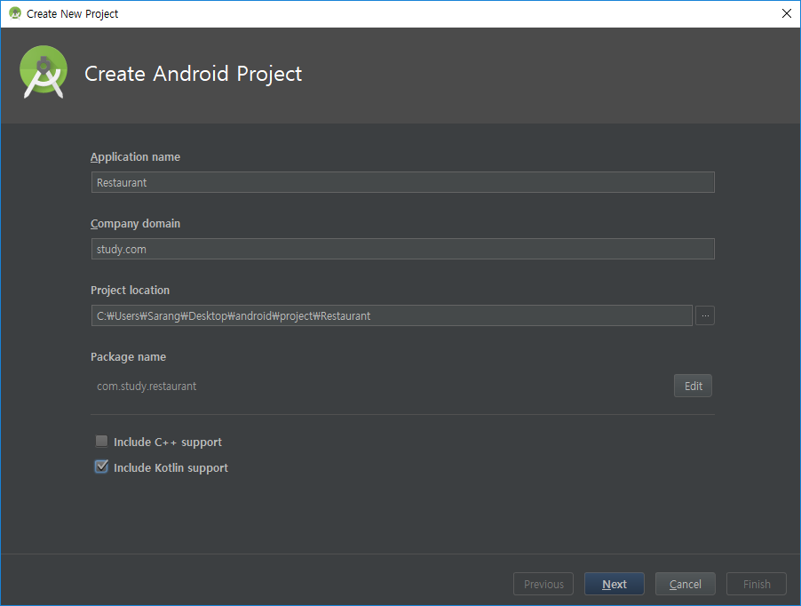
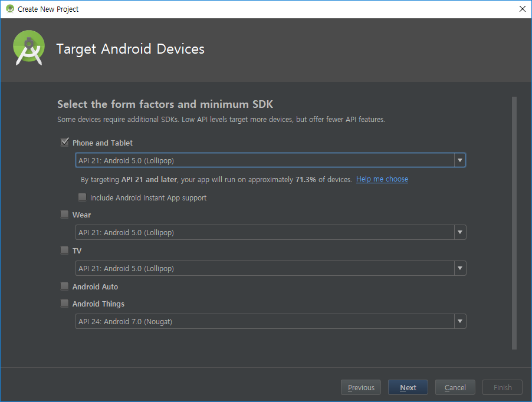

# Restaurant

## 소개
안녕하세요 안드로이드 개발 스터디 프로젝트 입니다.

스터디 날짜 및 시간 : 매주 토일요일 오후1시 ~ 오후 4시

비용 : 6천원 (매주 수요일 오후 2시까지 입금 기준으로 예약)

준비물 : 노트북

## 개발문서
https://drive.google.com/open?id=1EfbzRXmUDIfy4iQovcftCxq3qwHzh-hbaKqDqP-PsGo

## 플레이스토어 링크
https://play.google.com/store/apps/details?id=com.study.restaurant

## 1. 프로젝트 생성

## 기본 컴포넌트 샘플
https://github.com/sarang628/BasicComponent

## 레트로핏 샘플
https://github.com/sarang628/RetrofitSample