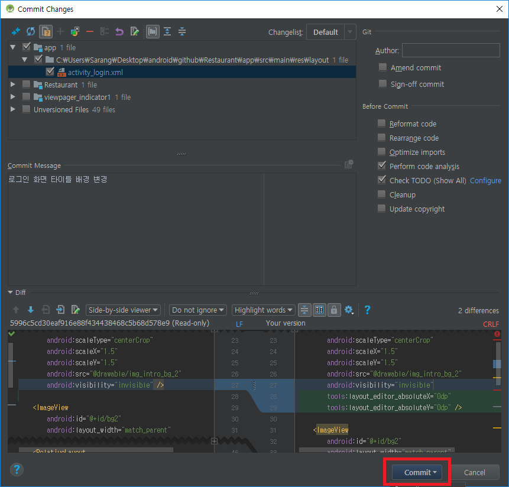

# Restaurant

## 개발문서
https://drive.google.com/open?id=1EfbzRXmUDIfy4iQovcftCxq3qwHzh-hbaKqDqP-PsGo

## 개발진행상황
https://docs.google.com/spreadsheets/d/1Us2VpNvM-DoLsIk1AkfVFqhb1HgKWXci0LCCHV1ebpA/edit?usp=sharing

## WireFrame
http://sarang628.iptime.org:83/wire_frame/index.html

## 플레이스토어 링크
https://play.google.com/store/apps/details?id=com.study.restaurant

## 기본 컴포넌트 샘플
https://github.com/sarang628/BasicComponent

## 레트로핏 샘플
https://github.com/sarang628/RetrofitSample

## 안드로이드 위치 기능 사용 샘플
https://github.com/sarang628/MyLocationManager

## 지오코딩(좌표 -> 주소 변환)
https://github.com/sarang628/Geocoding

## 하단 감지 RecyclerView + 프로그래스바
https://github.com/sarang628/BottomDetectionRecyclerView

## Git 사용방법
### 1. Github 사이트에서 주소 복사하기

### 2. 안드로이드 스튜디오에서 Git 선택하기

### 3. git clone 하기

### 4. 최초 빌드 안될 떄 Android SDK 설정해주기

### 5. Git Add 하기

작업한파일 또는 여러개의 파일일경우 폴더를 우측 클릭하고 Add 해줍니다.

### 6. Git Commit 하기

Add 후 Commit File or Directory를 선택해줍니다.

### 7. Commit / Push 하기

Commit Message 부분에 자신이 수정한 내용을 적고
우측하단의 Commit/Push 를 선택합니다.

### 8. Commit / Push 버튼 누르기

### 9. Push 버튼 누르기

### 10. Push 성공 메시지 확인하기

