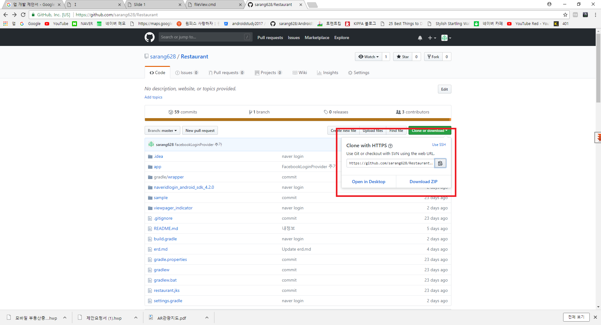

# Restaurant

## 소개
안녕하세요 안드로이드 개발 스터디 프로젝트 입니다.

스터디 날짜 및 시간 : 매주 토일요일 오후1시 ~ 오후 4시

비용 : 6천원 (매주 수요일 오후 2시까지 입금 기준으로 예약)

준비물 : 노트북

## Git 사용방법
### 1. Github 사이트에서 주소 복사하기

### 2. 안드로이드 스튜디오에서 Git 선택하기

### 3.

### 4.

### 5.

### 6.

### 7.

### 8.

### 9.

## 개발문서
https://drive.google.com/open?id=1EfbzRXmUDIfy4iQovcftCxq3qwHzh-hbaKqDqP-PsGo

## 플레이스토어 링크
https://play.google.com/store/apps/details?id=com.study.restaurant

## 기본 컴포넌트 샘플
https://github.com/sarang628/BasicComponent

## 레트로핏 샘플
https://github.com/sarang628/RetrofitSample

## 안드로이드 위치 기능 사용 샘플
https://github.com/sarang628/MyLocationManager

## 지오코딩(좌표 -> 주소 변환)
https://github.com/sarang628/Geocoding

## 1. 프로젝트 생성

