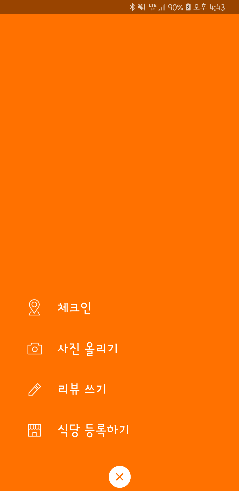
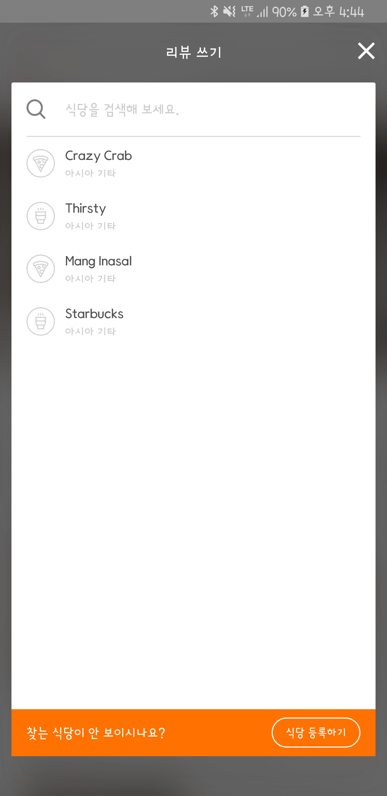
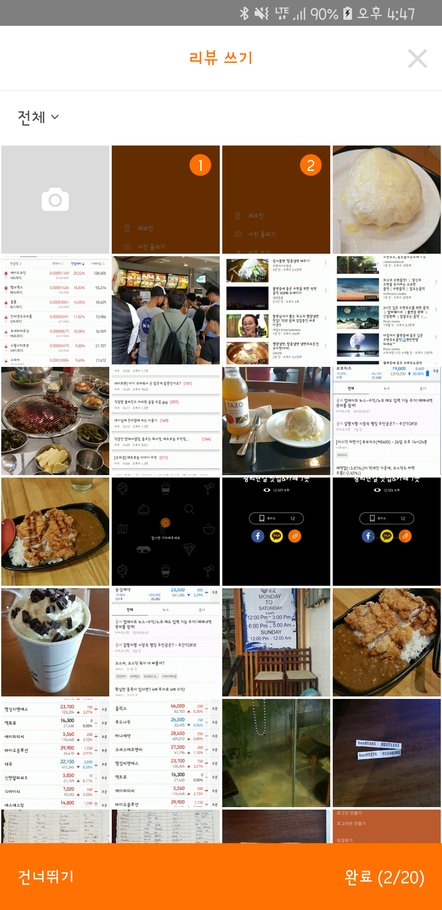
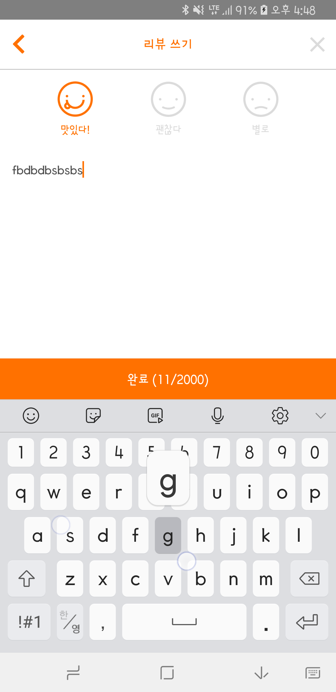

# 식당 등록하기 개발

식당 리뷰 등록 하기는 총 4단계로 구성되어 있다.

1. 메뉴화면
2. 식당 검색화면
3. 사진 업로드 화면
4. 리뷰 작성 화면


1. 메뉴화면


2. 식당 등록화면
​

3. 이미지 선택화면


4. 리뷰 등록화면



1.메뉴화면은 이미 개발 되어있는 상태여서 2.식당 검색화면을 개발해 보려고 한다.

2.식당 검색화면의 기능을 분석해봤다.

```
식당 검색화면 기능 분석
1. 내 현재 위치를 검색해 주면에 있는 식당이름을 우선으로 보여줌
2. 그러면 위치 검색 실패했을경우 그냥 아무것도 보여주지 않는다.
3. 사용자가 검색어를 입력하면 1,2 번의 동작은 취소하고 검색을 시작한다.
```

검색화면의 UI를 만들어보자. 일단 화면의 이름은 SearchRestaurantActivity 라고 정했다. 1.메뉴화면에서 리뷰쓰기 버튼을 눌렀을 때 식당검색화면으로 진입할 수 있게 연결을 해준다.

<div style="text-align: right"> SearchRestaurantActivity.java </div>

```
// 검색화면 이동 함수
public static void go(AppCompatActivity activity){
    Intent intent = new Intent(activity, SearchRestaurantActivity.class);
    activity.startActivity(intent);
}
```

<div style="text-align: right"> MainActivity.java </div>

```java
//식당 리뷰등 등록 메뉴 화면
layout_register = findViewById(R.id.layout_register);
//식당 리뷰 버튼 클릭 시 검색화면으로 이동하는 이벤트
layout_register.findViewById(R.id.review).setOnClickListener
        (view -> SearchRestaurantActivity.go(MainActivity.this));
```

이제 화면 부분을 만들어보자. 먼저 상단에 타이틀바 부분은 레이아웃을 include 할 것이라 따로 레이아웃을 만들었다

```xml
<?xml version="1.0" encoding="utf-8"?>
<layout xmlns:android="http://schemas.android.com/apk/res/android">

    <android.support.v7.widget.Toolbar
        android:id="@+id/actionBar"
        android:layout_width="match_parent"
        android:layout_height="?attr/actionBarSize">

        <RelativeLayout
            android:layout_width="match_parent"
            android:layout_height="match_parent">

            <TextView
                android:layout_width="wrap_content"
                android:layout_height="wrap_content"
                android:layout_centerInParent="true"
                android:text="리뷰 쓰기"
                android:textColor="#FFFFFF" />

            <ImageView
                android:id="@+id/close"
                android:layout_width="25dp"
                android:layout_height="match_parent"
                android:layout_alignParentRight="true"
                android:layout_centerVertical="true"
                android:onClick="clickClose"
                android:src="@drawable/ic_btn_close_white" />
        </RelativeLayout>
    </android.support.v7.widget.Toolbar>
</layout>
```

상단 레이아웃을 적용 한 코드이다.

<div style="text-align: right"> activity_search_restaurant.xml </div>

```xml
<?xml version="1.0" encoding="utf-8"?>
<LinearLayout xmlns:android="http://schemas.android.com/apk/res/android"
    xmlns:app="http://schemas.android.com/apk/res-auto"
    xmlns:tools="http://schemas.android.com/tools"
    android:layout_width="match_parent"
    android:layout_height="match_parent"
    android:background="#4E4E4E"
    tools:context=".activity.SearchRestaurantActivity">

    <!-- 타이틀바 -->
    <include layout="@layout/title_bar_search_restaurant" />

</LinearLayout>
```

완성 코드는 activity_search_restaurant.xml에서 볼 수 있다.

이제 사용자가 텍스트를 입력하면 서버에 요창하는 코드이다.
```java
//사용자가 키워드롤 입력했을 때 검색 요청하기
        ((EditText) findViewById(R.id.keyword)).addTextChangedListener(new TextWatcher() {
            @Override
            public void beforeTextChanged(CharSequence charSequence, int i, int i1, int i2) {

            }

            @Override
            public void onTextChanged(CharSequence charSequence, int i, int i1, int i2) {
                Message msg = new Message();
                msg.obj = charSequence.toString();
                msg.what = 0;
                handler.removeMessages(0);
                handler.sendMessageDelayed(msg, 300);
            }

            @Override
            public void afterTextChanged(Editable editable) {

            }
        });
```
입력하자마자 서버에 요청을하면 요청량을 감당 할 수 없으므로 0.3초의 딜레이를 주어 마지막 요청만 전달하게
만들었다. 통신이 시작되었을때도 통신중이라면 중간에 끊는 고 재요청하는 방법을 생각해봐야 할 것 같다.

이제 서버사이드쪽 처리를 구현해보자.
간단하게 post로 입력받은 키워드를 검색하는 쿼리를 짜면 될 것 같다.
```php
public static function getStoreKeyword()
    {
        $dbConnection = new DBConnection();
        $connect = $dbConnection->getConnect();

        if (!$connect)
            return;

        $mysql_database = 'banana';

        $keyword = $_POST['keyword'];

        // query test
        $query = sprintf("use %s", $mysql_database);
        $connect->query($query);
        $q = "select restaurant_name, address from Store where restaurant_name like '%$keyword%'";
        $stmt = $connect->prepare($q);
        echo $q;
        $result = $stmt->execute();
        $json = $stmt->fetchAll(PDO::FETCH_ASSOC);
        JsonUtil::printJson($json);
    }
```
like를 사용해서 맛집 이름과 맛집 주소를 가져오게 해봤다. 주소부분은 위와같이 하면 풀 주소를 가져오기때문에
지역과 시 이름을 가져와서 합치는 방법을 사용해아 할 것 같다.
쿼리 부분을 아래와 같이 수정하였다.
```
$q = "select restaurant_name, region_name, city_name from Store join Region on Store.region_id = Region.region_id join City on Store.city_id = City.city_id where restaurant_name like '%$keyword%'";
```

이부분을 이제 retrofit 에 적용한다음 호출해보았다.
```java
Map<String, String> param = new HashMap<>();
param.put("keyword", msg.obj.toString());
ApiManager.getInstance().getStoreKeyword(param, new ApiManager.CallbackListener() {
                @Override
                public void callback(String result) {

                }

                @Override
                public void failed(String msg) {

                }
            });
        }
```

callback 에서 받은 데이터를 gson을 이용해 파싱 한 후 리사이클러 뷰에 적용해주었다.

아이템을 클릭하면 다음 사진을 선택하는 화면으로 넘어가는 기능을 만들었다.

일단 여기 까지하고 다음화면은 사진 선택하는 화면을 개발해보려고한다.
