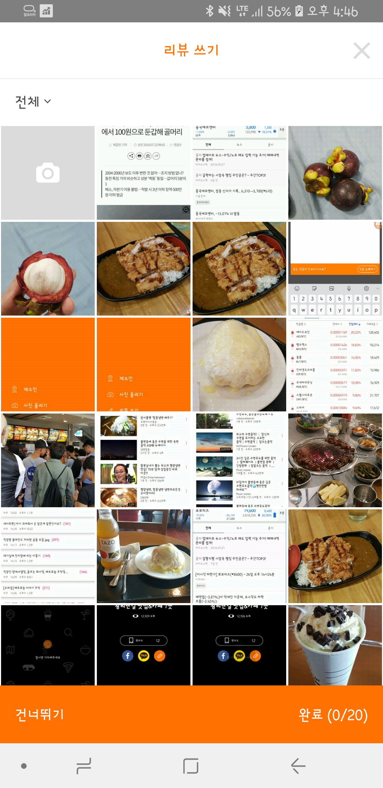

# 이미지 선택화면 개발하기

이미지 선택화면 UI


이미지 선택화면 xml
<div style="text-align: right"> activity_select_picture.xml </div>

```xml
<?xml version="1.0" encoding="utf-8"?>
<LinearLayout xmlns:android="http://schemas.android.com/apk/res/android"
    xmlns:app="http://schemas.android.com/apk/res-auto"
    xmlns:tools="http://schemas.android.com/tools"
    android:layout_width="match_parent"
    android:layout_height="match_parent"``
    android:orientation="vertical"
    tools:context=".activity.SelectPictureActivity">

    <include layout="@layout/title_bar_select_picture" />

    <Spinner
        android:id="@+id/spFolder"
        android:layout_width="wrap_content"
        android:layout_height="wrap_content"></Spinner>

    <android.support.v7.widget.RecyclerView
        android:id="@+id/selectPicRv"
        android:layout_width="match_parent"
        android:layout_height="match_parent" />
</LinearLayout>
```

이부분 기능을 구현하려면 content provider에서 이미지 처리 방법에 대한 학습이 필요하다.

이부분에 관련된 부분은 아래 링크를 참조하면 된다.


이미지 선택화면에 주요 기능으로는 아래와 같다.

```
1. 이미지 폴더 선택
2. 이미지 리스트에서 다중선택 기능
3. 선택된 이미지 하단에 정보 업데이트
4. 건너뛰기 혹은 완료 버튼 클릭 시 다음 화면으로 이동
```

1. 이미지 폴더 선택 기능을 구현해 보자.

먼저 이미지가 들어있는 폴더를 추출하는 기능이 필요하다.

위에서 얘기한 content resolver를 통해 폴더를 추출하는 코드를 구현해봤다.

```java
public ArrayList<String> requestPicFolderList() {

    if (Build.VERSION.SDK_INT >= Build.VERSION_CODES.M && !checkPermission()) {
        return null;
    }

    Uri uri = MediaStore.Images.Media.EXTERNAL_CONTENT_URI;
    String[] projection = {MediaStore.Images.Media.BUCKET_DISPLAY_NAME};

    Cursor cursor = getContentResolver().query(uri, projection, null, null, null);
    Map<String, String> folderMap = new TreeMap<>();
    if (cursor != null) {
        while (cursor.moveToNext()) {
            int columnIndex = cursor.getColumnIndex(MediaStore.Images.Media.BUCKET_DISPLAY_NAME);
            folderMap.put(cursor.getString(columnIndex), cursor.getString(columnIndex));
        }
        cursor.close();
    }

    ArrayList<String> folderList = new ArrayList<>(folderMap.values());
    folderList.add(0, "전체");

    return folderList;
}
```

폴더를 선택했을때 해당 폴더 안에 있는 이미지를 출력하는 코드를 구현해봤다.

```java
public ArrayList<MyImage> getPicList(String forderName) {
    Cursor cursor = null;
    Uri uri = null;
    String[] projection = new String[1];
    String selection = null;
    String[] selectionArgs = new String[1];
    String sortOrder = null;
    ArrayList<MyImage> myImageArrayList = new ArrayList<>();
    try {
        uri = MediaStore.Images.Media.EXTERNAL_CONTENT_URI;
        projection[0] = MediaStore.MediaColumns.DATA;
        selection = MediaStore.Images.ImageColumns.BUCKET_DISPLAY_NAME + " LIKE ?";
        selectionArgs[0] = "%" + forderName + "%";
        cursor = getContentResolver().query(uri, projection, selection, selectionArgs, sortOrder);

        if (cursor != null) {
            while (cursor.moveToNext()) {
                int columnIndex = cursor.getColumnIndex(MediaStore.MediaColumns.DATA);
                MyImage myImage = new MyImage();
                myImage.setData(cursor.getString(columnIndex));
                myImageArrayList.add(myImage);
            }
            cursor.close();
        }
    } catch (Exception e) {
        Log.e("sr", e.toString());
    }
    if (cursor != null)
        cursor.close();

    return myImageArrayList;
}
```

그다음은 2.이미지 리스트에서 다중선택 기능을 추가해야한다.

이기능을 구현하는 방법은 간단한데 한가지 까다로운 기능이 있다. 이미지를 5개 선택한 후 만약 3번째 이미지를 해제하면. 4번째 5번째 선택했던 이미지의 카운트가 4, 3으로 줄어야하는 기능이다. arrayList에서 remove를 하면 자동으로 인덱스는 이동하는데, 이 이동했을때 이벤트를 감지하여 뷰를 찾아가 줄여줘야한다. 

이를 해결하기위해 arrayList가 변경되었을때 notifyDataSetChanged()를 사용했다.

```java
((SelectPicHolder) holder).img.setOnClickListener((View view) -> {
    boolean isContained = selectedImgList.contains(myImageList.get(position));
    // 이미지를 선택했을때 선택 여부에 따라 딤과 카운트 보여지는 여부
    selectPicHolder.dim.setVisibility(isContained ? View.GONE : View.VISIBLE);
    selectPicHolder.tag.setVisibility(isContained ? View.GONE : View.VISIBLE);

    if (isContained) {
        selectedImgList.remove(myImageList.get(position));
        notifyDataSetChanged();
    } else {
        selectedImgList.add(myImageList.get(position));
        selectPicHolder.tag.setText("" + (selectedImgList.size() - 1));
    }
    selPicVM.setCount("" + selectedImgList.size());
});
```


3. 하단정보 업데이트 구현

업데이트부분은 Observable클래스를 사용하여 카운트가 변경되었을 때, noti를 전달하여 업데이트 하는 방법을 사용하였고, 건너뛰기 버튼이나 완료 버튼을 눌렀을 때, 다음화면으로 이미지 리스트를 넘겨주는 기능을 구현해야한다. 

```java
class SelPicVM extends BaseObservable {
    String count;
    
    @Bindable
    public String getCount() {
        return count;
    }

    public void setCount(String count) {
        this.count = count;
        notifyPropertyChanged(BR.count);
    }
}
...
selPicVM.addOnPropertyChangedCallback(new OnPropertyChangedCallback() {
    @Override
    public void onPropertyChanged(Observable sender, int propertyId) {
        count.setText(String.format("완료(%s/20)", selPicVM.getCount()));
    }
});
...
selPicVM.setCount("" + selectedImgList.size());
```


4. 건너뛰기 혹은 완료 버튼 클릭 시 다음 화면으로 이동

```
count.setOnClickListener(view -> {
    WriteReviewActivity.go(SelectPictureActivity.this, selectedImgList);
});

pass.setOnClickListener(view -> {
    WriteReviewActivity.go(SelectPictureActivity.this, new ArrayList<MyImage>());
});

...

public static void go(AppCompatActivity appCompatActivity, ArrayList<SelectPictureActivity.MyImage> myImageArrayList) {
    Intent intent = new Intent(appCompatActivity, WriteReviewActivity.class);
    intent.putExtra("selectedImageList", myImageArrayList);
    appCompatActivity.startActivity(intent);
}
```


여기까지 이미지 선택 화면을 완료 하고 다음 화면인 리뷰쓰기를 개발하자. 

